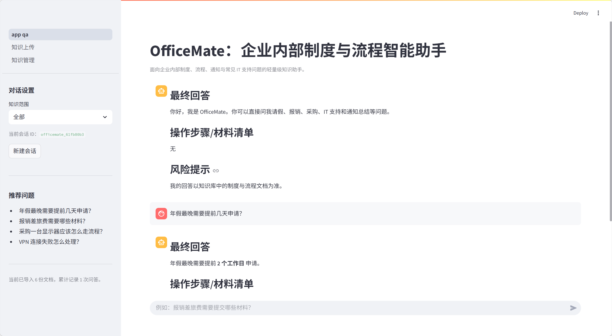
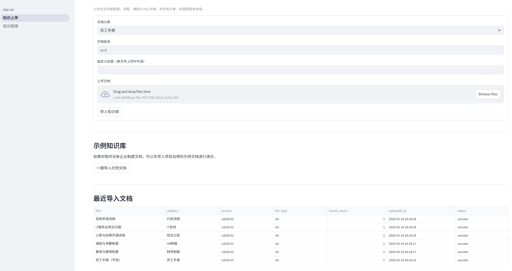
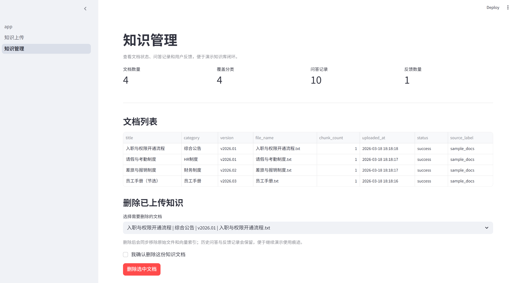

# OfficeMate

声明：本项目在黑马程序员 RAG 案例基础上做了扩展和整理，感谢原始案例的分享。

OfficeMate 是一个面向企业内部制度、流程和常见办公问题的智能问答项目。  
项目目标不是做泛聊天机器人，而是围绕企业知识场景，搭建一套完整的 `文档入库 -> 检索增强生成 -> 引用溯源 -> 日志反馈` 流程。

它重点解决的是：

- 企业制度问答
- 办公流程指引
- 材料清单提取
- 综合通知总结
- FAQ 检索与内部知识查询

整个系统围绕下面这条主线展开：

- 先上传制度文档
- 再把文档解析、切片、向量化
- 然后基于知识库做检索和回答
- 最后把引用来源、日志和反馈记录下来

如果你是为了课程项目、毕设演示、简历项目，或者想学习一个完整的 RAG 小项目，这个仓库会比较合适。

## 项目介绍

OfficeMate 主要面向企业内部高频办公场景，例如：

- HR 制度：年假、病假、调休、补卡、转正
- 财务制度：报销、借款、发票、补贴、冲销
- 行政流程：采购申请、办公用品、用印、访客、工位调整
- IT 支持：账号权限、VPN、设备报修、软件安装
- 综合公告：入职流程、跨部门协作、制度通知、活动安排

项目整体采用：

- `Streamlit` 负责前端页面交互
- `LangChain` 负责编排 RAG 流程
- `Chroma` 负责本地向量存储
- `OpenAI-compatible API` 负责聊天模型、embedding 和 rerank
- `JSON` 负责文档元数据、问答日志和反馈记录

这个项目既适合做课程项目和答辩展示，也适合作为一个完整 RAG 小系统来学习。

## 数据集与数据来源

这个项目当前使用了三类数据，分别服务于 `主系统演示`、`本地测评` 和 `标准 benchmark 测评`。

### 1. 示例知识库数据

主系统默认演示使用的是仓库中的 `sample_docs/` 目录数据。  
这些数据是我为企业内部办公场景整理的一组制度与流程文本，覆盖了多个常见业务域，例如：

- 员工手册
- 请假与考勤制度
- 差旅与报销制度
- 采购申请流程
- IT 服务台常见问题
- 入职与权限开通流程
- 账号权限与密码安全规范

这些文档主要用于：

- 演示知识上传与知识管理功能
- 构建 OfficeMate 的本地知识库
- 支撑主问答页面的制度问答、流程问答和通知总结

对应目录：

- [sample_docs](/Users/weijiaxin/Documents/pythonwork/OfficeMate-main/OfficeMate-main/sample_docs)

### 2. 本地题库测评数据

项目还内置了一套本地题库，用于评测 OfficeMate 主 RAG 系统本身。

这部分题目主要来自仓库中的样例文件，例如：

- `evaluation_samples.json`
- `complex_eval_samples.json`
- `manual_test_questions.json`
- `rag_question_bank_200.json`

这类数据的特点是：

- 问题和项目场景高度一致
- 更贴近 HR、财务、行政、IT 支持等企业办公问答
- 适合做本地调试、切片调参和效果对比

其中每条样例通常会包含：

- 用户问题
- 标准答案或参考答案
- 期望命中的文档标题
- 部分题目还会带分类信息

对应目录：

- [sample_docs/evaluation_samples.json](/Users/weijiaxin/Documents/pythonwork/OfficeMate-main/OfficeMate-main/sample_docs/evaluation_samples.json:1)
- [sample_docs/complex_eval_samples.json](/Users/weijiaxin/Documents/pythonwork/OfficeMate-main/OfficeMate-main/sample_docs/complex_eval_samples.json:1)
- [sample_docs/manual_test_questions.json](/Users/weijiaxin/Documents/pythonwork/OfficeMate-main/OfficeMate-main/sample_docs/manual_test_questions.json:1)
- [sample_docs/rag_question_bank_200.json](/Users/weijiaxin/Documents/pythonwork/OfficeMate-main/OfficeMate-main/sample_docs/rag_question_bank_200.json:1)

### 3. RAGBench 标准测评数据

为了让项目不只停留在“本地示例能跑通”，我还接入了 `RAGBench` 数据做标准 benchmark 测评。

当前代码里默认支持的 subset 包括：

- `techqa`
- `emanual`
- `delucionqa`

这些数据主要用于：

- 做标准化检索与生成评测
- 对比不同检索策略、Top-K 和切片参数
- 验证系统在公开 benchmark 上的表现

这部分数据在本地会放到：

- `storage/ragbench/<subset>/...`

项目中还提供了对应脚本和 benchmark 构建逻辑，用来下载数据、构建语料和生成向量索引。

对应代码与脚本：

- [pages/5_RAGBench测评.py](/Users/weijiaxin/Documents/pythonwork/OfficeMate-main/OfficeMate-main/pages/5_RAGBench测评.py:1)
- [services/benchmark_eval_service.py](/Users/weijiaxin/Documents/pythonwork/OfficeMate-main/OfficeMate-main/services/benchmark_eval_service.py:1)
- [services/benchmark_store.py](/Users/weijiaxin/Documents/pythonwork/OfficeMate-main/OfficeMate-main/services/benchmark_store.py:1)
- [scripts/download_ragbench.py](/Users/weijiaxin/Documents/pythonwork/OfficeMate-main/OfficeMate-main/scripts/download_ragbench.py:1)

### 4. 数据使用方式总结

这三类数据在项目中的分工是：

- `sample_docs/*.txt`：主系统演示知识库
- `sample_docs/*.json`：本地题库与人工测评题集
- `RAGBench`：标准 benchmark 测评数据

## 我做的 RAG

这个项目的核心不是“把文档传给模型直接问答”，而是实现了一条完整的 RAG 流水线。

### 1. 文档入库

我把知识库入库流程拆成了明确步骤：

1. 接收用户上传的 `txt/pdf/docx/xlsx/csv/zip` 文件
2. 按文件格式解析成统一纯文本
3. 做文本清洗和规范化
4. 按 chunk 规则切片
5. 生成 embedding
6. 写入 Chroma 向量库
7. 把文档信息记录到本地 JSON

这样做的好处是，文档解析、向量化、元数据管理是解耦的，后续方便维护和扩展。

### 2. Query Rewrite

在问答阶段，我没有直接用用户原问题去检索，而是先做问题改写。

这一层会做两件事：

- 对口语化问题做规范化
- 对企业术语做同义词扩展

例如用户问“补签怎么办”，系统会把“补卡、考勤更正、打卡异常”等术语一起纳入检索词，提升召回率。

### 3. Task Planning

如果用户问题比较复杂，系统不会直接生成答案，而是先把问题拆成多个子任务。

例如一个问题同时涉及“审批、报销、补贴”，系统会拆成多个任务分别检索和回答，最后再统一汇总。  
这样可以减少复杂问题回答时出现的信息混乱。

### 4. Hybrid Retrieval

检索部分我没有只做向量检索，而是采用了混合检索：

- 向量检索负责语义相似召回
- BM25 负责关键词和制度术语命中

这种组合比单一路径更稳，尤其适合企业制度场景中大量固定术语、材料名称和流程关键词。

### 5. Evidence Selection 与 Rerank

检索回来后，系统不会直接把所有片段交给模型，而是继续做证据筛选和重排。

这里结合了：

- rerank 模型语义重排
- 规则 bonus
- 分类命中
- 标题命中
- 任务 hints 命中

这样可以尽量把真正和问题相关的证据排在前面，提高回答质量和引用准确性。

### 6. Structured Answer

最终回答不是自由发挥，而是尽量保持固定结构：

- `最终回答`
- `操作步骤/材料清单`
- `风险提示`
- `引用文档`

这样更适合企业办公场景，也更适合答辩演示和结果展示。

## 我做的 Agent

除了固定 RAG 流水线，我还实现了两套 Agent 化实验，用来对比不同的问答编排方式。

### 1. Decision-ReAct

这一套方案会先让一个决策 Agent 判断当前问题的复杂度，再决定是否执行：

- query rewrite
- task planning
- answer synthesize

也就是说，它不是所有问题都走完整链路，而是根据问题复杂度动态决定使用轻路径还是重路径。

这套设计的意义在于：

- 简单问题减少不必要计算
- 复杂问题保留完整推理和检索步骤
- 更适合做“固定 RAG”与“决策型 Agent”对比

### 2. Agent-ReAct-RAG

这一套方案是真正的工具调用式 Agent。

我把现有能力封装成 4 个粗粒度工具：

- `rewrite_tool`
- `plan_tool`
- `retrieve_and_rerank_tool`
- `generate_final_answer_tool`

然后让 `create_agent(...)` 自己决定什么时候调用这些工具。  
也就是说，模型不再只是被动执行固定流程，而是可以主动决定要不要先改写、先拆任务、还是直接检索和生成答案。

这套方案更接近真正的 Agent 设计，也能展示从传统 RAG 到工具型 Agent 的升级路径。

## 我做的测评

为了让这个项目不只是“能跑起来”，我还补了两套评测能力，用来验证检索效果、答案效果，以及不同配置下的系统表现。

### 1. RAGBench 全局知识库测评

第一套测评是 `RAGBench` 评测。

它的特点是：

- 面向公开 benchmark 数据集
- 使用全局知识库模式
- 可以评估不同 subset、不同 split
- 支持切换检索策略、Top-K、Query Rewrite、Rerank、切片参数
- 每次 run 会保存问题、检索结果、答案和评分

这套评测的流程是：

1. 读取指定 subset 的 benchmark 数据
2. 构建对应的 benchmark 全局语料
3. 构建或重建 benchmark 向量索引
4. 批量运行检索和答案生成
5. 统计检索指标
6. 如果启用生成评测，再计算 Ragas 指标
7. 保存每次 run 的 summary 和 details

它的意义在于：

- 能用标准数据集验证系统效果
- 能做不同检索策略和切片配置的横向对比
- 能更系统地展示项目不仅有功能，还有评测闭环

对应代码：

- [pages/5_RAGBench测评.py](/Users/weijiaxin/Documents/pythonwork/OfficeMate-main/OfficeMate-main/pages/5_RAGBench测评.py:1)
- [services/benchmark_eval_service.py](/Users/weijiaxin/Documents/pythonwork/OfficeMate-main/OfficeMate-main/services/benchmark_eval_service.py:1)
- [services/benchmark_store.py](/Users/weijiaxin/Documents/pythonwork/OfficeMate-main/OfficeMate-main/services/benchmark_store.py:1)
- [services/benchmark_results.py](/Users/weijiaxin/Documents/pythonwork/OfficeMate-main/OfficeMate-main/services/benchmark_results.py:1)

### 2. 本地题库测评

第二套测评是本地题库评测。

这一套更贴近我自己的 OfficeMate 主问答系统，特点是：

- 使用 `sample_docs/*.txt` 构建独立知识库实例
- 与 app 正常问答页面数据库隔离
- 答案生成直接复用主系统的问答逻辑与提示词
- 可以评估不同知识库、不同切片参数、不同检索策略对结果的影响

这套评测的流程是：

1. 基于本地样例文档构建独立知识库
2. 读取本地评测题集
3. 复用主 RAG 问答链路批量跑题
4. 记录每题的 query rewrite、检索结果、最终答案和命中情况
5. 统计检索指标和生成指标
6. 保存历史 run，便于后续对比

这套设计的价值在于：

- 评估对象就是项目自己的主 RAG 系统
- 更适合做本地实验和迭代调参
- 能直接观察切片参数、Query Rewrite、Rerank 对效果的影响

对应代码：

- [pages/6_本地题库测评.py](/Users/weijiaxin/Documents/pythonwork/OfficeMate-main/OfficeMate-main/pages/6_本地题库测评.py:1)
- [services/local_eval_service.py](/Users/weijiaxin/Documents/pythonwork/OfficeMate-main/OfficeMate-main/services/local_eval_service.py:1)
- [services/local_eval_store.py](/Users/weijiaxin/Documents/pythonwork/OfficeMate-main/OfficeMate-main/services/local_eval_store.py:1)

### 3. 测评指标

项目当前测评重点关注两类指标：

- 检索指标：例如 `Recall@K`、`Hit Rate@K`、`MRR`
- 生成指标：例如基于 `Ragas` 的答案质量评测，以及 `Faithfulness`

也就是说，这个项目不仅验证“能不能检索到对的文档”，还会验证“最终答案是否和证据一致、是否回答得好”。

## 项目流程

项目可以概括为两条主流程：`知识入库流程` 和 `问答流程`。

### 1. 知识入库流程

用户在“知识上传”页面上传 `txt/pdf/docx/xlsx/csv/zip` 文件后，系统会按下面的顺序处理：

1. 读取上传文件，并提取文件名、分类、版本、自定义标题等信息。
2. 调用文档解析器，把不同格式的文件统一转换成纯文本。
3. 对文本做基础清洗，去掉空行、BOM 和不必要的格式差异。
4. 按设定的 `chunk_size` 和 `chunk_overlap` 把长文本切成片段。
5. 对每个片段生成 embedding。
6. 把片段和向量写入 Chroma 向量库。
7. 把文档元数据写入本地 JSON，记录文档标题、分类、版本、原始文件路径、切片数量和状态。

这条流程对应的核心代码：

- [services/document_service.py](/Users/weijiaxin/Documents/pythonwork/OfficeMate-main/OfficeMate-main/services/document_service.py:1)
- [services/document_parser.py](/Users/weijiaxin/Documents/pythonwork/OfficeMate-main/OfficeMate-main/services/document_parser.py:1)
- [services/vector_store.py](/Users/weijiaxin/Documents/pythonwork/OfficeMate-main/OfficeMate-main/services/vector_store.py:1)
- [services/upload_task_manager.py](/Users/weijiaxin/Documents/pythonwork/OfficeMate-main/OfficeMate-main/services/upload_task_manager.py:1)

### 2. 问答流程

用户在聊天页输入问题后，系统不是直接把问题扔给模型，而是会先走一条 RAG 流水线：

1. 判断问题类型。
   例如区分它是“制度问答”、“流程指引”还是“材料清单”。
2. 改写问题。
   对口语化表达做规范化，并补充企业术语同义词，生成更适合检索的 query。
3. 任务规划。
   如果问题比较复杂，会把一个问题拆成多个子任务，避免一次回答太散。
4. 混合检索。
   同时做向量检索和 BM25 关键词检索，尽量兼顾语义召回和术语命中。
5. 证据重排。
   用 rerank 模型和规则 bonus，把更相关的文档片段排到前面。
6. 子任务回答。
   每个子任务基于自己的证据独立生成回答。
7. 最终汇总。
   如果问题被拆成了多个子任务，就再把多个子答案合并成一份最终回答。
8. 输出引用来源。
   回答末尾展示引用文档标题、分类、版本和文件名。
9. 记录日志。
   把问答内容、会话 ID、引用文档和反馈信息写入本地 JSON。

这条流程对应的核心代码：

- [services/rag/chat_service.py](/Users/weijiaxin/Documents/pythonwork/OfficeMate-main/OfficeMate-main/services/rag/chat_service.py:1)
- [services/rag/query.py](/Users/weijiaxin/Documents/pythonwork/OfficeMate-main/OfficeMate-main/services/rag/query.py:1)
- [services/rag/planning.py](/Users/weijiaxin/Documents/pythonwork/OfficeMate-main/OfficeMate-main/services/rag/planning.py:1)
- [services/rag/retrieval.py](/Users/weijiaxin/Documents/pythonwork/OfficeMate-main/OfficeMate-main/services/rag/retrieval.py:1)
- [services/rag/selection.py](/Users/weijiaxin/Documents/pythonwork/OfficeMate-main/OfficeMate-main/services/rag/selection.py:1)
- [services/rag/answering.py](/Users/weijiaxin/Documents/pythonwork/OfficeMate-main/OfficeMate-main/services/rag/answering.py:1)

## 项目亮点

### 1. 不只是“检索后拼答案”，而是完整 RAG 链路

项目把文档上传、解析、切片、向量化、混合检索、证据重排、结构化回答、引用展示和日志管理完整串起来，流程比较完整。

### 2. 做了 Query Rewrite 和 Task Planning

相比很多基础 RAG 项目，这个系统多了一层问题改写和任务拆解，能更好处理口语化问题和复杂多意图问题。

### 3. 做了 Hybrid Retrieval

向量检索和 BM25 结合，使系统既能理解语义，也能命中制度术语、材料名和流程关键词，更适合企业知识场景。

### 4. 做了证据重排与预算分配

系统不会把检索结果原样送给模型，而是继续做 rerank、聚合、去重和证据预算控制，尽量提升最终引用质量。

### 5. 回答可追溯

每次回答尽量附带引用来源，能说明答案来自哪份文档、哪个分类、什么版本，这一点对企业制度问答非常重要。

### 6. 同时实现了 RAG 与 Agent 两套路线

项目不仅有固定 RAG 流水线，还有 `Decision-ReAct` 和 `Agent-ReAct-RAG` 两套 Agent 化实验，适合做技术深度展示和对比分析。

### 7. 补齐了评测闭环

项目除了问答和 Agent 设计，还实现了 `RAGBench 测评` 和 `本地题库测评` 两条评估链路，可以从检索和生成两个维度验证系统效果，这一点会让整个项目比单纯“做了一个聊天页”更完整。

## 页面功能

### 1. 智能问答页



这一页是主入口，负责：

- 选择知识范围
- 发起对话式提问
- 展示最终回答
- 展示引用来源
- 记录用户反馈

### 2. 知识上传页



这一页负责：

- 上传文档
- 补充分类、版本和标题
- 导入示例知识库
- 查看后台上传进度
- 查看最近导入记录

### 3. 知识管理页



这一页负责：

- 查看文档数量、问答数量、反馈数量
- 查看文档列表
- 查看最近问答日志
- 查看反馈记录
- 删除已上传知识及对应向量索引

### 4. RAGBench 测评页

这一页负责：

- 选择 benchmark subset 和 split
- 配置检索策略、Top-K、Query Rewrite、Rerank 和切片参数
- 构建 benchmark 全局知识库
- 批量运行标准 benchmark
- 查看每次 run 的 summary 和 details

### 5. 本地题库测评页

这一页负责：

- 基于本地样例文档构建独立知识库
- 选择本地评测题集
- 配置检索策略、Top-K、Query Rewrite、Rerank 和切片参数
- 批量运行主 RAG 问答链路
- 查看历史 run 和题目级测评结果

## 项目结构

```text
OfficeMate/
├─ app.py                      # 主聊天页入口
├─ app_qa.py                   # 兼容旧入口
├─ app_file_uploader.py        # 兼容旧入口
├─ pages/                      # Streamlit 多页面入口
├─ services/                   # 核心服务层
│  ├─ document_service.py      # 文档入库总流程
│  ├─ document_parser.py       # 多格式文档解析
│  ├─ vector_store.py          # Chroma 向量库封装
│  ├─ storage_service.py       # JSON 存储
│  ├─ benchmark_eval_service.py# RAGBench 测评服务
│  ├─ local_eval_service.py    # 本地题库测评服务
│  └─ rag/                     # 主 RAG 链路
├─ decision_react/             # Decision-ReAct 实验链路
├─ agent_react_rag/            # Agent-ReAct-RAG 实验链路
├─ sample_docs/                # 示例制度文档
├─ storage/                    # 本地 JSON、原始文档、向量库
├─ config_data.py              # 项目配置
└─ requirements.txt            # 依赖列表
```

## 运行方式

### 1. 安装依赖

```bash
pip install -r requirements.txt
```

### 2. 配置模型接口

项目当前通过 `.env` 或环境变量读取模型配置，常用项包括：

- `OPENAI_API_KEY`
- `OPENAI_BASE_URL`
- `OPENAI_MODEL`
- `EMBEDDING_BASE_URL`
- `EMBEDDING_MODEL`
- `RERANK_BASE_URL`
- `RERANK_MODEL`

如果你使用本地 OpenAI-compatible 服务，常见配置方式类似：

```env
OPENAI_API_KEY=your_api_key
OPENAI_BASE_URL=http://127.0.0.1:8000/v1
OPENAI_MODEL=your_chat_model

EMBEDDING_API_KEY=local
EMBEDDING_BASE_URL=http://127.0.0.1:8000/v1
EMBEDDING_MODEL=your_embedding_model

RERANK_API_KEY=local
RERANK_BASE_URL=http://127.0.0.1:8000/v1
RERANK_MODEL=your_rerank_model
```

### 3. 启动应用

推荐使用主入口：

```bash
streamlit run app.py
```

兼容旧入口也可以继续使用：

```bash
streamlit run app_qa.py
streamlit run app_file_uploader.py
```

## 适合怎么讲这个项目

如果你要答辩、汇报或者写简历，可以把它概括成：

`一个基于 Streamlit + LangChain + Chroma 的企业知识问答系统，支持文档上传、知识入库、混合检索、证据重排、结构化回答和引用来源展示。`

如果想再具体一点，可以补一句：

`系统把文档入库流程和问答流程拆开设计，问答阶段包含问题改写、任务拆解、混合检索、rerank 和答案汇总，适合展示完整的 RAG 应用链路。`

## 补充说明

- 项目适合本地学习、课程展示和简历项目整理。
- 当前使用本地 JSON 存储，优点是轻量、好理解，缺点是不适合高并发生产场景。
- 仓库里还包含 `Decision-ReAct` 和 `Agent-ReAct-RAG` 两套实验链路，适合做技术对比演示。
